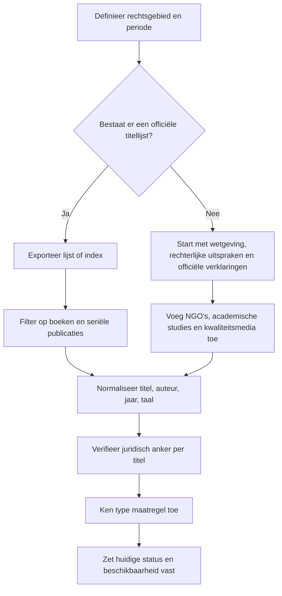

# Bronnenlandschap voor verboden boeken in zeven rechtsgebieden

## Bestuurlijke samenvatting

De snelste weg naar een corpus van **honderden verboden of ooit verboden boektitels** loopt niet via één universele databank, maar via een **gestapelde bronstrategie**. In entity["country","Rusland","land in Eurazië"] bestaat wél een officiële, titelrijke kernbron: de urlfederale lijst van extremistische materialen van het Russische ministerie van Justitieturn2search0, verankerd in urlfederale wet 114-FZ tegen extremistische activiteitenturn2search2. In entity["country","Frankrijk","land in West-Europa"] en entity["country","Spanje","land in Zuidwest-Europa"] is de infrastructuur anders, maar minstens zo rijk: wettelijke databanken, ministeriële besluiten, commissiearchieven, inquisitie-indexen en grote bibliografische compendia maken daar serieuze bulkextractie mogelijk. In entity["country","Turkije","land in West-Azië en Zuidoost-Europa"] leveren officiële “muzır”-besluiten, ministeriële mededelingen en constitutionele uitspraken tientallen direct verifieerbare cases op. In entity["country","China","land in Oost-Azië"], entity["place","Hongkong","speciale administratieve regio van China"] en entity["country","Marokko","land in Noord-Afrika"] ontbreekt daarentegen meestal een transparante, publieke masterlijst; daar moet je reconstructief werken, met wetgeving, uitgeversmeldingen, bibliotheekverwijderingen, NGO-rapporten, academische studies en betrouwbare nieuwsarchieven. citeturn2search0turn2search2turn34search5turn33search1turn25search8turn39search6turn40search12turn17search9

Als je prioriteit geeft aan **opbrengst per uur**, zou ik beginnen met vier massa-bronnen: de Russische federale lijst, het Franse post-1949-traject via Legifrance/FranceArchives/Joubert, de Spaanse inquisitie-indexen plus franquistische censuurdossiers, en de Turkse reeks officiële “muzır”-besluiten. Daarna pas zou ik de minder transparante velden ontginnen: het post-1989 bronlandschap in entity["country","China","land in Oost-Azië"], de niet-gepubliceerde maar herleidbare bibliotheek- en veiligheidsverwijderingen in entity["place","Hongkong","speciale administratieve regio van China"], en de SIEL-/import-/territorialiteitsdossiers in entity["country","Marokko","land in Noord-Afrika"]. Dat is niet alleen efficiënter; het maakt ook meteen duidelijk waar “verbod” juridisch hard is, en waar het feitelijk of administratief werkt zonder nette publieke titellijst. citeturn30search17turn34search0turn33search1turn25search12turn32search0turn39search6turn28search7turn40search3turn35search7

| Rechtsgebied | Hoogste-opbrengst startbron | Verwachte opbrengst | Praktische conclusie |
|---|---|---|---|
| entity["country","Rusland","land in Eurazië"] | urlOfficiële federale lijst extremistische materialenturn2search0 | Zeer hoog | Eén primaire bron, direct doorzoekbaar; filter op `книга`, `изд.` en auteursnamen. citeturn2search0turn30search17 |
| entity["country","China","land in Oost-Azië"] | urlpublicatiebeheerregeling van de Staatsraadturn5search0 + urlacademische studie over post-Tiananmen boekcensuurturn28search7 | Middel | Geen publiek officieel masterregister; combineer wetgeving, casuïstiek, CECC/academia en uitgeversrecalls. citeturn5search0turn5search2turn28search7turn38search2 |
| entity["place","Hongkong","speciale administratieve regio van China"] | urlHong Kong e-Legislationturn41search1 + bibliotheekverwijderingsonderzoek | Middel tot hoog | Geen volledige officiële titellijst; catalogus-diffs en pers/NGO’s zijn onmisbaar. citeturn41search1turn27search5turn28search5turn40search12 |
| entity["country","Turkije","land in West-Azië en Zuidoost-Europa"] | urlwet nr. 1117 en ministeriële “muzır”-mededelingenturn39search1 | Middel | Officiële bulk is kleiner dan in Rusland/Spanje, maar wel juridisch scherp en goed traceerbaar. citeturn39search1turn39search6 |
| entity["country","Marokko","land in Noord-Afrika"] | urlPress and Publishing Code in WIPO Lexturn17search9 + lokale persarchieven | Laag tot middel | Geen transparante titelmasterlijst; reconstructie via boekbeurzen, importkwesties en reputabele pers. citeturn17search9turn17search6turn35search7 |
| entity["country","Frankrijk","land in West-Europa"] | urlLegifrance + Justice.fr + FranceArchives + Joubert/BnFturn34search5 | Hoog | Post-1949 heel goed reconstrueerbaar; voor oudere periodes aanvullende archieven nodig. citeturn34search5turn34search0turn33search1 |
| entity["country","Spanje","land in Zuidwest-Europa"] | urlBNE-indexen + MetaPARES/AGA + BOEturn25search8 | Zeer hoog | Voor de vroegmoderne tijd en het franquisme is de bronbasis uitzonderlijk sterk. citeturn25search8turn25search12turn32search0turn24search1 |

## Afbakening, methode en betrouwbaarheid

Voor dit onderwerp is “verboden boek” geen uniforme juridische categorie. In de zeven gevraagde rechtsgebieden zie je minstens vijf patronen terugkomen: **formele opname op een verbodslijst** zoals in entity["country","Rusland","land in Eurazië"]; **administratieve of informele publicatie-/distributieblokkade** zoals vaak in entity["country","China","land in Oost-Azië"]; **bibliotheekverwijdering en veiligheidsreview** zoals in entity["place","Hongkong","speciale administratieve regio van China"]; **leeftijdsbeperking/opaque verpakking** via de Turkse “muzır”-procedure; en **beurs-, import- of territoriale uitsluiting** zoals in entity["country","Marokko","land in Noord-Afrika"]. In entity["country","Frankrijk","land in West-Europa"] en entity["country","Spanje","land in Zuidwest-Europa"] moet je bovendien scherp scheiden tussen hedendaagse rechtsbasis en historische censuurregimes. Zonder die afbakening raak je al snel appels, peren en een halve archiefdoos kwijt. citeturn2search0turn5search0turn40search12turn39search1turn17search9turn34search5turn24search1

Mijn methodische volgorde zou steeds dezelfde zijn: **eerst het primair-juridische spoor, dan het archiefspoor, dan de secundaire reconstructie**. Concreet betekent dit: start met wet of besluit, leg daarna de titel aan een officiële lijst, rechterlijke beslissing, parlementair stuk, archieffinding aid of bibliotheekrecord, en gebruik pas daarna NGO’s, academische syntheses of kwaliteitsmedia om ontbrekende metadata en statusvelden te vullen. Met andere woorden: eerst de ruggengraat, pas daarna de spieren. citeturn34search1turn34search0turn32search0turn28search7turn40search3turn17search6

| Brontype | Voorbeeld | Betrouwbaarheid | Beste gebruik |
|---|---|---|---|
| Officiële wet, officiële lijst, officiële uitspraak | url114-FZ en de Russische federale lijstturn2search2; urlHong Kong e-Legislationturn41search1; urlTurkse wet nr. 1117turn39search1; urlLegifrance 1949-wetturn34search5 | Zeer hoog | Juridische basis, formele status, datum, bevoegde instantie. citeturn2search0turn41search1turn39search1turn34search5 |
| Officiële archieffinding aid of archiefportaal | urlFranceArchives-inventaris van de Franse commissieturn34search0; urlMetaPARES over censuurbronnenturn32search0 | Hoog | Voor massale reconstructie, seriële dossiervorming en historische context. citeturn34search0turn34search10turn32search0 |
| Nationale bibliotheek of erkende bibliografische compilatie | urlBnF-record van Jouberts woordenboek van verboden werkenturn33search1; urlBNE-publicatie Malos librosturn25search12 | Hoog | Titelnormalisatie, bibliografische controle, bulkidentificatie. citeturn33search1turn25search12 |
| Academische studie of dataset | urlSong over post-Tiananmen boekcensuurturn28search7; urlUCM/ACE over franquistische censuur van 1984turn45search0 | Hoog | Wanneer de staat geen nette publieke titellijst vrijgeeft; goed voor historische clustering. citeturn28search7turn45search0turn45search3 |
| NGO- of mensenrechtenrapport | urlOHCHR-concluding observations over Hongkongturn40search12; urlFreedom House bulletin over bibliotheekcensuurturn27search8; urlPublic Book Policies in the Arab Worldturn17search6 | Middel tot hoog | Cruciaal voor ondoorzichtige of informele censuurpraktijken; minder sterk voor precieze bibliografie dan primaire bronnen. citeturn40search12turn27search8turn17search6 |
| Kwaliteitsmedia | urlReuters over Zhang Yiheturn47search2; urlReuters over de Chongzhen-terugroepactieturn29search3; urlTelQuel over Le roi prédateurturn36view4 | Middel | Onmisbaar voor contemporaine, niet-transparante, informele of snel veranderende gevallen. citeturn47search2turn29search3turn36view4 |

De uitbreidingsmethode naar een dataset met honderden titels kun je praktisch zo opzetten: exporteer of scrape eerst alle titels uit de meest seriële primaire bron, label vervolgens per titel het **type interventie** (verbod, beslag, recall, review, bibliotheekverwijdering, importblokkade, leeftijdsbeperking), verrijk bibliografie en vertalingen uit catalogi/uitgeversrecords, en sluit af met een **statuskolom** waarin je onderscheid maakt tussen *nog van kracht*, *opgeheven*, *historisch*, *formeel onduidelijk maar feitelijk ontoegankelijk* en *alleen buitenlands/ondergronds beschikbaar*. Dat laatste statuselement maakt het verschil tussen een nette spreadsheet en een nuttige. citeturn30search17turn34search0turn25search12turn39search6turn40search12

| Rechtsgebied | Mijn voorkeursarchief of basisbron | Suggestie voor zoekopdrachten |
|---|---|---|
| entity["country","Rusland","land in Eurazië"] | urlRussische federale lijst extremistische materialenturn2search0 | `site:minjust.gov.ru/extremist-materials книга`, `site:minjust.gov.ru/extremist-materials "Рисале-и Нур"`, `site:minjust.gov.ru/extremist-materials автор` |
| entity["country","China","land in Oost-Azië"] | urlStaatsraad-regeling publicatiebeheerturn5search0; urlSong over post-Tiananmen boekcensuurturn28search7 | `site:gov.cn 出版管理条例`, `site:cecc.gov 书名 ban`, `禁书 书名 出版 总署`, `图书 召回 出版 社` |
| entity["place","Hongkong","speciale administratieve regio van China"] | urlHong Kong e-Legislationturn41search1; urlOHCHR-aanbeveling publiceer de lijstturn40search12 | `site:legco.gov.hk removed books public libraries`, `site:legislation.gov.hk sedition publications`, `site:hkpl.gov.hk title author` |
| entity["country","Turkije","land in West-Azië en Zuidoost-Europa"] | urlwet nr. 1117 en Aile Bakanlığı-bronnenturn39search1 | `site:aile.gov.tr muzır kitap`, `site:kararlarbilgibankasi.anayasa.gov.tr kitap toplatma`, `site:resmigazete.gov.tr muzır neşriyat kitap` |
| entity["country","Marokko","land in Noord-Afrika"] | urlWIPO Lex: Press and Publishing Codeturn17search9 | `site:hespress.com منع كتاب المعرض الدولي للنشر والكتاب`, `site:telquel.ma livre interdit Maroc`, `SIEL livre interdit Maroc` |
| entity["country","Frankrijk","land in West-Europa"] | urlLegifrance + FranceArchives + BnF/Joubertturn34search5 | `site:legifrance.gouv.fr article 14 loi 1949 interdiction`, `site:francearchives.gouv.fr publications jeunesse commission`, `site:gallica.bnf.fr arrêté publication interdite` |
| entity["country","Spanje","land in Zuidwest-Europa"] | urlBNE + MetaPARES + BOEturn25search12 | `site:pares.cultura.gob.es censura libro expediente`, `site:bne.es índices libros prohibidos`, `site:boe.es ley prensa imprenta censura` |

## entity["country","Rusland","land in Eurazië"]

Voor entity["country","Rusland","land in Eurazië"] is de bronhiërarchie veruit het duidelijkst. De primaire, beste startbron is de urlofficiële federale lijst van extremistische materialenturn2search0; die lijst wordt formeel gekoppeld aan rechterlijke beslissingen via artikel 13 van urlwet 114-FZturn2search2. Daarnaast is er een urlexport-PDF van de lijstturn30search17, wat voor seriële extractie praktisch goud is: je kunt systematisch filteren op woorden als `Книга`, `изд.` en op auteurs- of reeksnamen. Omdat de actuele lijst al zichtbaar tot voorbij item 5.400 loopt, is dit niet zomaar een casusbron maar een echte bulkbron. citeturn2search0turn2search2turn30search17turn30search0

Je moet hier wel methodisch streng zijn. Niet alles in de federale lijst is een boek; er staat van alles tussen, van brochures tot video’s en websites. Daarom zou ik een Russische harvest in drie slagen doen: eerst de hele lijst exporteren, dan regex/keyword-filteren op boekachtige records, en vervolgens per hit de onderliggende rechterlijke titel, datum en formulering van de beslissing overnemen. Als je dat netjes doet, heb je niet alleen een lijst van verboden werken, maar ook per titel een juridisch anker dat later controleerbaar blijft. citeturn30search17turn2search0

| Broninventaris | Type | Waarom cruciaal |
|---|---|---|
| urlFederale lijst van extremistische materialenturn2search0 | Primair/officieel | Hoofdregister; titelrijk en juridisch verankerd. citeturn2search0turn2search2 |
| urlExport-PDF van de lijstturn30search17 | Primair/officieel | Handig voor bulkextractie en filtering op boekrecords. citeturn30search17 |
| Onderliggende rechterlijke beslissingen uit de lijstitem-pagina’s | Primair/officieel | Nodig voor exacte verbodsdatum, bevoegde rechtbank en scope. citeturn2search0turn3search0 |

Zichtbare voorbeeldtitels in de officiële lijst zijn onder meer entity["book","Преодоление христианства","boek van V. B. Avdeev"] (*Overcoming Christianity*) van V. B. Avdeev, entity["book","Плоды веры","boek uit de Risale-i Nur-reeks"] (*Fruits of Faith*) van entity["people","Said Nursi","Ottomaans-Koerdische islamitische denker"], en entity["book","Основательно свидетельствуем о Царстве Бога","religieus boek van Watch Tower Bible and Tract Society"] (*Bearing Thorough Witness About God’s Kingdom*). Een extra, nuttig controlegeval is entity["book","ФСБ взрывает Россию","Russischtalig politiek boek"] (*FSB Blows Up Russia*), waarvan het zoekresultaat expliciet verwijst naar een beslissing van de stadsrechtbank van Sint-Petersburg van 6 augustus 2015. Voor deze titels is de huidige status helder: wie in de federale lijst staat, blijft formeel als verboden/extremistisch materiaal geregistreerd totdat een wijziging of rechterlijke correctie anders bepaalt. citeturn43search0turn43search2turn43search3turn3search0turn30search17

## entity["country","China","land in Oost-Azië"]

In entity["country","China","land in Oost-Azië"] bestaat er **geen publiek, stabiel, centraal en volledig officieel register** van verboden boeken dat vergelijkbaar is met het Russische model. De primaire ruggengraat zit daarom niet in een titellijst, maar in het normatieve kader: de urlPublicatiebeheerregeling van de Staatsraadturn5search0 en de urldouaneregels voor in- en uitgaande drukwerken en audiovisuele productenturn5search2. Voor titelniveau moet je vervolgens aanvullen met casuïstiek uit officiële of quasi-officiële analyses zoals de urlCECC-analyse over Yan Lianke’s Serve the People!turn29search1, academische syntheses zoals urlY. Song, Book Censorship in Post-Tiananmen Chinaturn28search7, en hoogwaardige berichtgeving over terugroepacties of strafexpliciete ingrepen. citeturn5search0turn5search2turn29search1turn28search7turn38search2

Dat klinkt omslachtig, maar het is precies hoe het Chinese veld werkt: een mix van formele verboden inhoudscategorieën, uitgeverssancties, recalls, ondergronds circulerende edities en zeer selectieve publieke communicatie. Voor een groot corpus zou ik daarom niet zoeken op “lijst verboden boeken”, maar op **clusters**: expliciete seksuele inhoud, Cultural Revolution/Tiananmen/Anti-Rightist-campagne, partijgeschiedenis, satirische historische allegorie en Hongkong-/Taiwan-gerelateerde politieke non-fictie. Die thematische clustering werkt in China beter dan de illusie van één nette overheidslijst. citeturn47search0turn47search2turn29search3turn28search7

| Broninventaris | Type | Waarom cruciaal |
|---|---|---|
| urlPublicatiebeheerregeling van de Staatsraadturn5search0 | Primair/officieel | Geeft verboden inhoudscategorieën en administratieve basis. citeturn5search0 |
| urlDouaneregels voor drukwerken en audiovisuele productenturn5search2 | Primair/officieel | Essentieel voor importgerelateerde verboden en inbeslagnames. citeturn5search2 |
| urlCECC-dossiers over concrete verboden titelsturn29search1 | Semi-primair/regeringsanalyse | Sterk voor case-by-case reconstructie. citeturn29search1turn38search2 |
| urlSong, Book Censorship in Post-Tiananmen Chinaturn28search7 | Academisch | Beste overzichtswerk voor systematische aanvulling buiten officiële lijsten. citeturn28search7 |

Concreet gedocumenteerde voorbeeldtitels zijn entity["book","为人民服务","roman van Yan Lianke"] (*Serve the People!*) van entity["people","Yan Lianke","Chinese romanschrijver"], dat in 2005 werd verboden omdat de titel een Mao-slogan satiriseerde; entity["book","上海宝贝","roman van Wei Hui"] (*Shanghai Baby*) van entity["people","Wei Hui","Chinese romanschrijver"] en entity["book","Candy","roman van Mian Mian"] van entity["people","Mian Mian","Chinese romanschrijver"], beide in 2000 verboden wegens expliciete seksuele inhoud; entity["book","伶人往事","non-fictieboek van Zhang Yihe"] (*Past Stories of Peking Opera Stars*) van entity["people","Zhang Yihe","Chinese schrijver"], onderdeel van de veelbesproken acht-boekenactie van 2007; en entity["book","崇祯：勤政的亡国君","historisch boek over de Chongzhen-keizer"] (*Chongzhen: The Diligent Emperor of a Fallen Dynasty*), dat in 2023 door de uitgever werd teruggeroepen nadat online vergelijkingen met entity["politician","Xi Jinping","president van China"] opdoken. De huidige beschikbaarheid is typisch Chinees dubbelzinnig: officieel onwenselijk of teruggetrokken op het vasteland, maar vaak nog te vinden in buitenlandse edities, piratenkopieën of Hongkong-uitgaven. citeturn29search1turn47search0turn47search13turn47search2turn38search2turn29search3

## entity["place","Hongkong","speciale administratieve regio van China"]

Voor entity["place","Hongkong","speciale administratieve regio van China"] is de centrale bevinding bijna frustrerend simpel: **de overheid heeft de titel-lijst niet openbaar gemaakt**, ondanks herhaalde vragen van internationale mensenrechteninstanties. De juridische bronbasis zelf is wel helder, met de urlHong Kong e-Legislation-databankturn41search1, de tekst van de urlnationale veiligheidswet voor Hongkong op de site van het Office for Safeguarding National Securityturn41search2 en de in 2024 toegevoegde delictarchitectuur rond onder meer het importeren van publicaties met opruiende bedoeling. Maar voor een feitelijke titelinventaris moet je terugvallen op bibliotheekcatalogusvergelijkingen, parlementaire stukken, personderzoek en NGO-documentatie. citeturn41search1turn41search2turn41search10turn40search12

Dat gebrek aan transparantie is zelf een belangrijk datapunt. In 2022 vroeg het VN-Mensenrechtencomité expliciet om een lijst van uit openbare bibliotheken verwijderde boeken te publiceren; in dezelfde periode is in officiële en semi-officiële stukken zichtbaar dat de overheid de review van “boeken met hoger risico” heeft opgevoerd. De praktische consequentie is dat je in Hongkong geen klassieke “verboden-boekenlijst” harvest, maar een **reconstructie** maakt uit verdwenen catalogusrecords, bekende verwijderingsgolven, strafzaken en meldingen over aangehouden boekverkopers of seditieuze publicaties. citeturn40search3turn40search12turn48search5turn40news31

| Broninventaris | Type | Waarom cruciaal |
|---|---|---|
| urlHong Kong e-Legislationturn41search1 | Primair/officieel | Juridische basis; nodig voor Artikel 23/opruiings- en publicatiedelicten. citeturn41search1turn41search10 |
| urlVN-concluding observations over Hongkongturn40search12 | Hoogwaardige mensenrechtenbron | Bevestigt expliciet dat een publieke lijst ontbreekt en dat publicatie daarvan wordt verlangd. citeturn40search12 |
| urlGlobal Voices over verwijderde bibliotheekboekenturn27search5 | Secondair, titelgericht | Geeft concrete verwijderde titels en auteurs. citeturn27search5 |
| urlThe Collective/Brian Kern-overzicht via Substackturn28search5 | Secondair, datasetachtig | Handig voor schaal en catalogus-diffs; 255 Chinese e-books verwijderd tussen 2020 en 2023. citeturn28search5 |

Expliet gerapporteerde voorbeeldtitels zijn entity["book","I Am Not a Kid","boek van Joshua Wong"] en entity["book","I Am Not a Hero","boek van Joshua Wong"] van entity["people","Joshua Wong","Hongkongse activist"], die door rapportages over bibliotheekverwijderingen bij naam zijn genoemd. Daarnaast laten latere catalogusonderzoeken zien dat de verwijdering niet beperkt bleef tot een handvol symbolische titels: onderzoekers troffen honderden verdwenen of ontoegankelijke e-books aan, terwijl de overheid haar versnelde reviewproces voor “higher risk” boeken opvoerde. De huidige statusvelden die je in een dataset voor Hongkong nodig hebt zijn daarom niet alleen *verboden* of *niet verboden*, maar ook *verwijderd uit openbare bibliotheken*, *onder review*, *aanleiding voor winkelmelding of strafonderzoek* en *status onbekend omdat de overheid geen lijst publiceert*. citeturn27search5turn28search5turn48search5turn40search12

## entity["country","Turkije","land in West-Azië en Zuidoost-Europa"]

entity["country","Turkije","land in West-Azië en Zuidoost-Europa"] is bronmatig interessanter dan het op het eerste gezicht lijkt. De officiële basis is urlwet nr. 1117 inzake bescherming van minderjarigen tegen schadelijke publicatiesturn39search1, plus de institutionele inbedding van de raad bij het urlAile Bakanlığı-dossier over de taken van het secretariaatturn39search2. Die bronfamilie levert niet altijd een klassiek totaalverbod op, maar wel een zeer specifieke status: *muzır* betekent in de praktijk dat publicaties niet vrij voor minderjarigen beschikbaar mogen zijn en onder restrictieve distributieregels vallen. De overheid meldde zelf dat sinds september 2018 **38 boeken** als schadelijk voor minderjarigen waren aangemerkt. citeturn39search1turn39search2turn39search6

Wie naar honderden titels wil, moet in Turkije twee sporen koppelen: het **administratief-restrictieve spoor** van de “muzır”-besluiten, en het **grondrechten-/confiscatiespoor** in de databank van het Constitutionele Hof. Dat tweede spoor is belangrijk, omdat het laat zien welke verboden of beslagmaatregelen later door de rechter zijn teruggefloten. Een Turkse dataset zonder statuskolom *nog van kracht / vernietigd door AYM* is eigenlijk maar half af. citeturn15view3turn16view0turn15view1

| Broninventaris | Type | Waarom cruciaal |
|---|---|---|
| urlwet nr. 1117turn39search1 | Primair/officieel | Juridische basis voor “muzır”-kwalificaties. citeturn39search1 |
| urlministeriële meldingen over concrete “muzır”-boekenturn39search7 | Primair/officieel | Geeft titel, auteur, vertaler, uitgever en motivering. citeturn39search7turn39search4 |
| Constitutioneel Hof, individuele klachten | Primair/officieel | Onmisbaar voor latere opheffing of grondrechtelijke correctie. citeturn15view3turn16view0turn15view1 |
| urloverzicht van 38 schadelijke boeken sinds 2018turn39search6 | Primair/officieel | Geeft schaal en bevestigt doorlopende productie van titels. citeturn39search6 |

Officiële en juridisch goed traceerbare voorbeeldtitels zijn entity["book","Makul Şüphe","Turkse editie van Reasonable Doubt"] (*Reasonable Doubt*) van entity["people","Whitney Gracia Williams","Amerikaanse schrijver"], dat door het ministerie als *muzır* werd aangemerkt; zeven delen uit de serie entity["book","Çıtır Çıtır Felsefe","kinderboekenreeks"], die in 2022 eveneens zo werden geclassificeerd; entity["book","Ayın En Çıplak Günü","boek van Buket Uzuner"] van entity["people","Buket Uzuner","Turkse schrijver"], waarbij het Constitutionele Hof in 2024 een schending van de uitingsvrijheid vaststelde; en entity["book","Kürdistan Devrim Manifestosu, Kürt Sorunu ve Demokratik Ulus Çözümü","boek van Abdullah Öcalan"] van entity["politician","Abdullah Öcalan","Koerdische politieke leider"], waarvan eerdere confiscatie- en beslagmaatregelen uiteindelijk niet standhielden. De huidige status varieert dus scherp: sommige werken blijven alleen onder volwassenendistributie beschikbaar, andere werden na constitutionele toetsing gerehabiliteerd. citeturn39search7turn39search4turn15view3turn16view0turn15view1

## entity["country","Marokko","land in Noord-Afrika"]

Voor entity["country","Marokko","land in Noord-Afrika"] is de juridische basis wel publiek, maar de titeltransparantie opvallend beperkt. De basisregels liggen in de urlMorokkaanse Press and Publishing Code in WIPO Lexturn17search9; secundaire maar gezaghebbende analyses benadrukken dat publicaties die als schadelijk voor islam, monarchie, territoriale integriteit of openbare orde worden gezien, kunnen worden gesloten of van de markt geweerd. Voor de praktijk op titelniveau moet je echter vooral naar lokale Franstalige en Arabischtalige pers, beursverslaggeving en mensenrechtenreacties kijken. citeturn17search9turn17search0turn17search6

De boekbeursen zijn hier een sleutelmechanisme. In 2017 verklaarde de vertegenwoordiger van de Internationale Salon voor Uitgeverij en Boek (SIEL) dat **dertig** titels niet tot de beurs werden toegelaten, waarvan er **achtentwintig** een volgens de autoriteiten onaanvaardbare kaart van Marokko bevatten en twee tot geweld zouden aanzetten. Dat is methodisch belangrijk, want het laat zien dat veel Morokkaanse verbodsdata niet in één nette “nationale index” verschijnen, maar in verspreide beurs- en distributiebeslissingen. De praktijk is dus minder codex, meer sediment. citeturn35search7

| Broninventaris | Type | Waarom cruciaal |
|---|---|---|
| urlPress and Publishing Code in WIPO Lexturn17search9 | Primair/officieel | Wettelijke grondslag voor publicatiebeperkingen. citeturn17search9 |
| urlPublic Book Policies in the Arab Worldturn17search6 | Hoogwaardige regiostudie | Helpt de Marokkaanse praktijk in regionale context te plaatsen. citeturn17search6 |
| urlHespress over 30 geweigerde titels op SIEL 2017turn35search7 | Lokale kwaliteitsbron | Essentieel voor beursverboden en motieven zoals territoriale integriteit. citeturn35search7 |
| urlTelQuel en Livres Hebdo over verboden titels rond de monarchieturn36view4 | Lokale/sectorbron | Beste route naar concrete titelcasussen in de afwezigheid van een officiële lijst. citeturn36view4turn18search8 |

Betrouwbaar gemelde voorbeeldtitels zijn entity["book","Le roi prédateur","Franstalig non-fictieboek over Mohammed VI"] (*The Predator King*) van entity["people","Catherine Graciet","Franse journalist"] en entity["people","Éric Laurent","Franse journalist"], dat door TelQuel werd beschreven als een boek dat de lijst van “interdits” verlengt; entity["book","Notre ami le roi","boek van Gilles Perrault"] (*Our Friend the King*) van entity["people","Gilles Perrault","Franse schrijver"], waarvan RSF uitdrukkelijk meldde dat het onder entity["politician","Hassan II","koning van Marokko"] verboden was; entity["book","Le Jour du Roi","roman van Abdellah Taïa"] (*Day of the King*) van entity["people","Abdellah Taïa","Marokkaanse schrijver"], door Livres Hebdo genoemd in hetzelfde verbodscluster; en entity["book","مذكرات مثلية","Arabischtalige roman van Fatima al-Zahra Amzkar"] (*Memoirs of a Lesbian*) van entity["people","Fatima al-Zahra Amzkar","Marokkaanse schrijver"], die in 2022 van SIEL werd verwijderd, waarna de Nationale Raad voor de Mensenrechten de maatregel bekritiseerde. De huidige status is in Marokko vaak niet netjes binair: sommige titels zijn niet openlijk nationaal verboden, maar wel feitelijk geweerd van distributiekanalen, beursverkoop of reguliere beschikbaarheid. citeturn36view4turn18search8turn18search14turn37search2turn37search13

## entity["country","Frankrijk","land in West-Europa"] en entity["country","Spanje","land in Zuidwest-Europa"]

Voor entity["country","Frankrijk","land in West-Europa"] is de broninfrastructuur verrassend institutioneel. De formele pijlers zijn de urlwet van 16 juli 1949 op publicaties voor de jeugdturn34search5, de actuele uitleg van de urlFranse commissie voor jeugdpublikaties op Justice.frturn34search1, en de archiefinventarissen van urlFranceArchives voor de werkzaamheden en processen-verbaal van die commissieturn34search0. Daarbovenop komt een praktisch onmisbare bibliografische superbron: het door de BnF gecatalogiseerde urlDictionnaire des livres et journaux interdits van Bernard Joubertturn33search1. Dat is precies het soort bron waar een onderzoeker blij van wordt: niet sexy, wel enorm productief. citeturn34search5turn34search1turn34search0turn33search1

Klassieke Franse voorbeeldtitels zijn entity["book","La Question","boek van Henri Alleg"] van entity["people","Henri Alleg","Frans-Algerijnse journalist"], waarvan in 1958 in parlementaire context expliciet werd gesproken als een door de regering in beslag genomen boek; entity["book","Éden, Éden, Éden","boek van Pierre Guyotat"] van entity["people","Pierre Guyotat","Franse schrijver"], getroffen door een drievoudig ministerieel verbod in 1970 en volgens latere studies pas in 1981 vrij van die censuur; en entity["book","Suicide, mode d'emploi","boek van Claude Guillon en Yves Le Bonniec"] van entity["people","Claude Guillon","Franse schrijver"] en entity["people","Yves Le Bonniec","Franse schrijver"], dat rechtstreeks leidde tot de Franse strafbaarstelling van provocatie tot zelfdoding en nog decennialang juridisch beladen bleef. Dat de Franse verbodsmachinerie geen museumstuk is, blijkt bovendien uit een ministerieel verbod uit 2019 dat nog steeds via artikel 14-mechanismen in het Journal officiel verscheen. citeturn23search6turn23search15turn23search5turn22search2turn21search1turn22search5turn20search4

Voor entity["country","Spanje","land in Zuidwest-Europa"] moet je meteen twee lagen onderscheiden. De eerste is de vroegmoderne laag van inquisitie en expurgatie: de BNE laat zien dat zij de volledige reeks Spaanse indices van verboden en gezuiverde boeken van 1551 tot 1790 bezit, en haar publicatie urlMalos libros: la censura en la España modernaturn25search12 is daar een uitstekende ingang voor. De tweede laag is het franquisme en zijn nawerking: daarvoor zijn de urlLey de Prensa e Imprenta van 1966 in de BOEturn24search1, de latere inperking van administratieve opschortingsbevoegdheden in 1977, en vooral urlMetaPARES/Archivo General de la Administraciónturn32search0 de kernbronnen. Samen vormen ze geen lijst, maar wel een archiefeconomie waar je jaren in kunt verdwijnen zonder je te vervelen. citeturn25search8turn25search12turn24search1turn24search13turn32search0

Als werkbare Spaanse voorbeeldtitels noem ik entity["book","Sempre en Galiza","politiek boek van Castelao"] van entity["people","Alfonso Daniel Rodríguez Castelao","Galicische schrijver en politicus"], waarvan recente UCM-publicatie de verbodenstatus onder de franquistische dictatuur reconstrueert, en entity["book","1984","roman van George Orwell"] van entity["people","George Orwell","Britse schrijver"], waarbij onderzoek naar de eerste Spaanse vertaling laat zien hoe franquistische censuur niet alleen verbood, maar ook vertalend vervormde. Wie hier naar honderden titels wil, moet niet blijven hangen in losse emblematische boeken, maar de inquisitie-indexen en franquistische expedientes als seriële dataset behandelen. Dáár zit de schaal. citeturn45search3turn45search7turn45search0turn45search4turn32search0